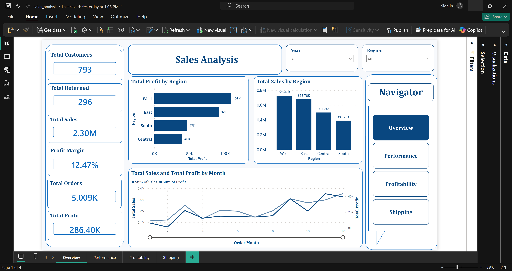
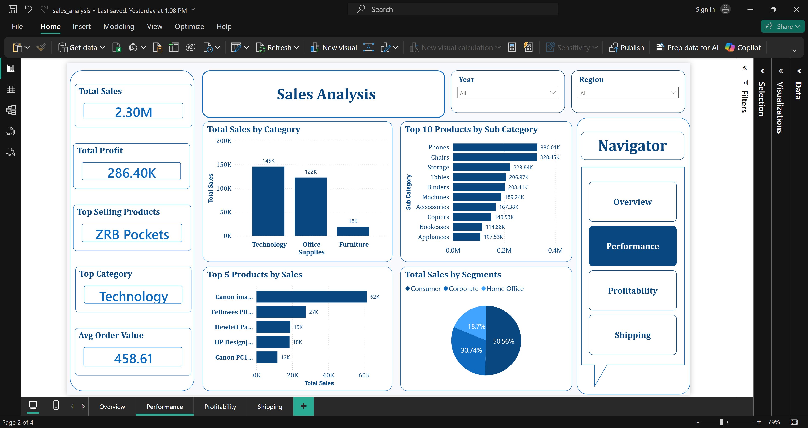
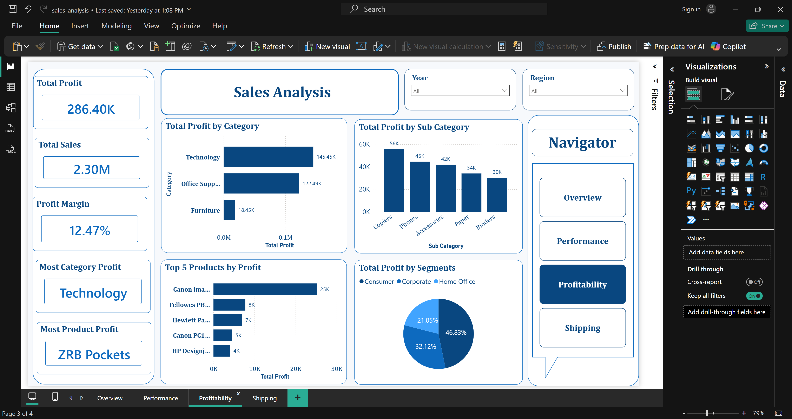
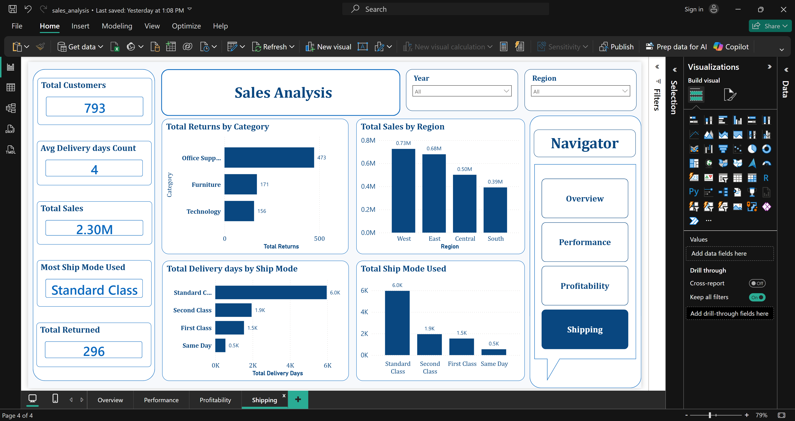

📊 Sales & Performance Analytics Dashboard

📌 Project Overview
This project is an interactive analytics dashboard built to analyze sales, profitability, customers, and shipping performance.
The dashboard helps transform raw transactional data into actionable business insights to support strategic decision-making.

-------------------------------------------------------------------------------------------------------------------------------------
It is structured into four analytical views:

Overview
Performance Analysis
Profitability Analysis
Shipping Analysis

-------------------------------------------------------------------------------------------------------------------------------------
🎯 KPIs
Total Sales
Total Profit
Profit Margin %
Orders Count
Customers Count
Returns Count
📈 Visuals
Monthly Sales Trend
Monthly Profit Trend
Sales by Region
Profit by Region
-------------------------------------------------------------------------------------------------------------------------------------
2️⃣ Performance Analysis
🎯 KPIs
Total Sales
Average Order Value (AOV)
Top Selling Product
Top Category
📈 Visuals
Sales by Category
Sales by Sub-Category
Top 10 Products by Sales
Sales by Segment
-------------------------------------------------------------------------------------------------------------------------------------
3️⃣ Profitability Analysis
🎯 KPIs
Total Profit
Profit Margin
Most Profitable Product
Most Profitable Category
📈 Visuals
Profit by Category
Profit by Sub-Category
Profit by Segment
Top 10 Products by Profit

-------------------------------------------------------------------------------------------------------------------------------------
4️⃣ Shipping Analysis
🎯 KPIs
Customers Count
Average Delivery Days
Most Used Ship Mode
Returns Count
📈 Visuals
Delivery Time by Ship Mode
Ship Mode Usage
Returns by Category

-------------------------------------------------------------------------------------------------------------------------------------
💡 Key Insights & Recommendations
📊 Sales Insights
Focus on top-performing categories to maximize revenue
Improve marketing for low-performing segments
💰 Profitability Insights
Some high-sales products have low profit → consider pricing optimization
Focus on high-margin categories for better ROI
👥 Customer Insights
Identify high-value customer segments for targeted campaigns
Improve retention strategies for low-engagement segments
🚚 Shipping Insights
Optimize slow delivery ship modes to improve customer satisfaction
Reduce return rate by analyzing problematic categories
-------------------------------------------------------------------------------------------------------------------------------------
📷 Dashboard Preview

-------------------------------------------------------------------------------------------------------------------------------------
Project Goal
To provide a complete analytical view of business performance and enable data-driven decisions that improve revenue, profitability, and operational efficiency.
